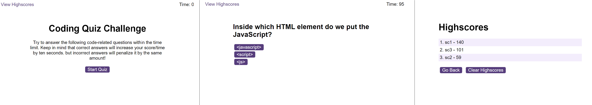

# JavScript Quiz

## Description

A short multiple-choice timed quiz, testing the user's basic knowledge of the programming language. 

Each question has three choices to pick from, and a timer that increases or decreases depending on whether the right or wrong answer was given. 

After all questions have been answered or the timer has run out, the user can input their initials and save their score locally. Saved scores can be accessed and cleared from the "View Highscores" tab. 

### Visual 

## Installation
No installation needed. 

## Usage
The page can be accessed through the [following link](https://dsciocan.github.io/javascript-quiz).

To begin, press the "Start Quiz" button on the main page. The first multiple choice question will appear on the screen, along with three answer buttons. 

Pressing any of the buttons will display a text indicating whether the answer was correct or incorrect, along with a sound effect. Then, the quiz will continue on to the next question. The quiz is timed, with a timer that starts at 100 seconds, then further increases or decreases by 10 seconds for every correct/incorrect answer. The amount of time remaining at the end of the quiz signifies the user's score.

Once the timer reaches 0 or all questions have been answered, the user is shown a page where they can view their score and save it locally by typing their initials in the input field and then pressing submit. The score then gets saved to the "View Highscores" page, where saved scores are sorted from lowest to highest. Pressing the "Clear Highscores" will erase all saved scores. 

## Credits
Starter code from [Boot Camp Gitlab](https://git.bootcampcontent.com/uk-edx-16-week/UK-VIRT-FE-PT-09-2023-U-LOLC).

Some of the quiz questions have been taken from [W3schools JavaScript Quiz](https://www.w3schools.com/quiztest/quiztest.asp?qtest=JS).

Code lines 87-94 and 118-124 from script.js follow this guide: [Create a Quiz App with Timer using HTML CSS and JavaScript](https://www.geeksforgeeks.org/create-a-quiz-app-with-timer-using-html-css-and-javascript/).

High score sorting follows this guide: [Sort an Array of Objects in JavaScript](https://www.javascripttutorial.net/array/javascript-sort-an-array-of-objects/).

## License
License information is available in the [License](LICENSE) file.
